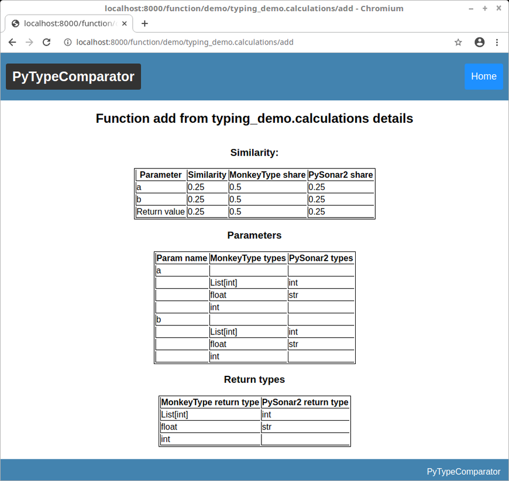

Web application using framework Django. It was used as a tool for results comparison between MonkeyType and PySonar 2 tool, which are used to auto generate type annotations for Python codebase. This app presents accuracy of each tool.

Example screenshots can be found in `img` directory.

